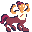

#  Sentaur Survivors

A Sentry-themed Vampire Survivors clone written for Unity in C# featuring:
* Fast paced 2D shoot 'em up action!
* 3 weapons with their own unique behavior and upgrade paths
* 5 different enemies
* 3 tactical item pickups

## Dependencies

Requires Unity 2022.3.7f1.

## Contributing

See [CONTRIBUTING](CONTRIBUTING.md).

## Credits

Sentaur Survivors was originally developed in a single week as part of [@getsentry's](https://github.com/getsentry) internal 2023 Hack Week event. The development team was:

* Michelle Fu ([@mifu67](https://github.com/mifu67)) - art/animation for title screen, player character, pickups, icons + programming
* Olivier Williams ([@olivier-w](https://github.com/olivier-w)) - UI design and sound effects + programming
* Isabella Enriquez ([@isabellaenriquez)](https://github.com/isabellaenriquez) - weapon and projectile systems
* Daniel Cardozo - art for level tileset, Sentaur art/animation
* Ben Vinegar ([@benvinegar](https://github.com/benvinegar)) - general game programming

Ant and Mantis art/animation by [Hannah Katz](https://dribbble.com/HKatz) is taken from [sentry-defenses](https://github.com/getsentry/sentry-defenses) (another @getsentry game project).

## License

Game source code, art assets, and sound effects are licensed under Apache 2.0 (see LICENSE).

The in-game music track, ["37 ohmperios" by Rolemusic](https://freemusicarchive.org/music/Rolemusic/single/37-ohmperios/), is used under [CC BY 4.0](https://creativecommons.org/licenses/by/4.0/).

DOTween is distributed under [DOTween's Artistic License](https://dotween.demigiant.com/license.php).
