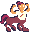

# ⚠️ THIS REPO IS SOFT-ARCHIVED - MOST RECENT VERSION LIVES ON [SENTRY-DEMOS](https://github.com/sentry-demos/unity)

#  Sentaur Survivors

A Sentry-themed Vampire Survivors clone written for Unity in C# featuring:
* Fast paced 2D shoot 'em up action!
* 4 weapons with their own unique behavior and upgrade paths
* 7 different enemies
* 6 tactical item pickups

🍿 Watch [the original trailer on YouTube](https://www.youtube.com/watch?v=8z4T97gJ7Rg)

## Playing the game

### Where to get it

You have a couple choices for playing:

* [Download binaries for macOS](https://github.com/getsentry/sentaur-survivors/releases/latest)

### How to play

* Defeat enemies and pick up XP
* Choose your upgrades wisely
* Survive!

#### Keyboard ⌨️
* WASD/arrow keys to move + select upgrades
* Mouse to aim + select/confirm upgrades
* Spacebar to confirm upgrades
* ESC to pause

#### Controller 🎮
* Left thumbstick to move + select upgrades
* Right thumbstick to aim
*  (PlayStation)   (Xbox)   (Switch) select upgrade

#### Mobile 📱
* Touch and drag Left on-screen joystick to move
* Touch and drag Right on-screen joystick to aim
* Tap to select upgrades

## Dependencies

Requires Unity 2022.3.7f1.

## Contributing

See [CONTRIBUTING](CONTRIBUTING.md).

## Leaderboard / Top 10

Live leaderboard: http://sentaur-survivor.com ([repo](https://github.com/getsentry/sentaur-leaderboard))

## Credits

Sentaur Survivors was originally developed in a single week as part of [@getsentry's](https://github.com/getsentry) internal 2023 Hack Week event by:

* Ben Vinegar ([@benvinegar](https://github.com/benvinegar)) - general game programming, project lead
* Michelle Fu ([@mifu67](https://github.com/mifu67)) - art/animation for title screen, player character, pickups, icons + programming
* Olivier Williams ([@olivier-w](https://github.com/olivier-w)) - UI design and sound effects + programming
* Isabella Enriquez ([@isabellaenriquez)](https://github.com/isabellaenriquez) - weapon and projectile systems
* Daniel Cardozo - art for level tileset, Sentaur art/animation

Other contributors:

* Stefan Jandl ([@bitsandfoxes)](https://github.com/bitsandfoxes) - leaderboard, random fixes

Ant and Mantis art/animation by [Hannah Katz](https://dribbble.com/HKatz) is taken from [sentry-defenses](https://github.com/getsentry/sentry-defenses) (another @getsentry game project).

## License

Game source code, art assets, and sound effects are licensed under Apache 2.0 (see LICENSE).

The in-game music track, ["37 ohmperios" by Rolemusic](https://freemusicarchive.org/music/Rolemusic/single/37-ohmperios/), is used under [CC BY 4.0](https://creativecommons.org/licenses/by/4.0/).

DOTween is distributed under [DOTween's Artistic License](https://dotween.demigiant.com/license.php).

Controller button icons from [Wikimedia Commons](https://commons.wikimedia.org/) are used under [CC BY-SA 4.0](https://creativecommons.org/licenses/by-sa/4.0/).
